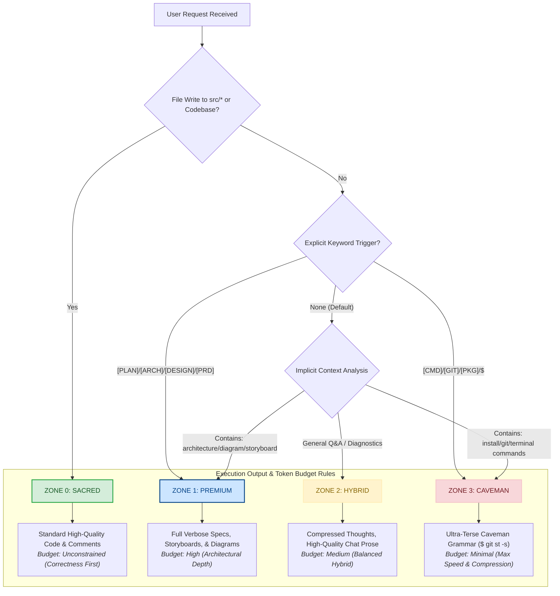

# ⚡ FinOps Token Optimization System (Antigravity × Caveman Ecosystem)

[](LICENSE)
[](https://github.com/Rezhnn/Token-Optimization/stargazers)
[](#benchmark)

The **FinOps Token Optimization System** is a next-generation hybrid runtime configuration for AI coding agents (such as Google Antigravity, Claude Code, and Cursor). By implementing the **Zone-Based Execution Model**, it dynamically shifts the model's verbosity and style between hyper-detailed system specs and ultra-compressed "caveman grammar." 

The result? **A massive 60% to 90% reduction in API token usage** during developer sessions without sacrificing code quality or architectural depth.

---

## 🔮 The 4 Zone-Based Execution Model

Different developer tasks demand different cognitive and stylistic fidelity. Instead of wasting thousands of expensive context tokens on conversational pleasantries, terminal summaries, or git logs, this system segment-routes the AI into **4 distinct execution zones**:



### Detailed Zone Breakdown

#### 🟢 ZONE 0 — SACRED (Fidelity-First Code Writing)
*   **Rule:** Standard programming grammar. Absolutely NO caveman grammar, sparse syntax, or token-saving abbreviations in output. Use full SOLID, KISS, DRY, and Clean Code principles.
*   **Scope:** Any file write targeting source code (`src/**`, `lib/**`, `components/**`, `*.py`, `*.ts`, `*.rs`, etc.), docstrings, and inline code comments.
*   **Enforcement:** Auto-triggers whenever the agent modifies source files.

#### 🔵 ZONE 1 — PREMIUM (High-Fidelity Planning)
*   **Rule:** Full verbose, highly detailed, beautifully structured markdown with rich visuals (Mermaid diagrams) and comprehensive user storyboards. No truncation.
*   **Scope:** Triggered explicitly by `[PLAN]`, `[ARCH]`, `[DESIGN]`, `[PRD]`, `[BRIEF]`, `[REVIEW]`, or keyword context like "architecture", "diagram", "storyboard".

#### 🟡 ZONE 2 — HYBRID (Default Balanced State)
*   **Rule:** **"Think cheap, output proper."** The agent compresses internal reasoning (chain-of-thought) into terse formats to save input tokens, but responds to the user in high-quality, polite, professional prose.
*   **Scope:** Standard debug analysis, code explanations, general Q&A.

#### 🔴 ZONE 3 — CAVEMAN (Ultra-Compressed Terminal/Git Operations)
*   **Rule:** Hyper-terse, compressed "caveman grammar." Preambles are completely bypassed. Output is raw, functional, and minimal.
*   **Scope:** Triggered explicitly by `[CMD]`, `[GIT]`, `[PKG]`, `$`, `!fast`, or implicit actions like installs, running test suites, or checking git status.

---

## 📊 Token Usage Benchmarks

When using advanced LLM models (e.g. Gemini 1.5/2.0 Pro, Claude 3.5 Sonnet, GPT-4o) over a 2-hour pair programming session, traditional verbose responses consume massive amounts of context. Here is the comparative breakdown:

### Token Consumption: Before vs. After FinOps Optimization

| Operation Type | Verbose Baseline | FinOps Hardened | Token Savings | Speed Increase |
| :--- | :---: | :---: | :---: | :---: |
| **Git Status Check & Diffs** | 4,200 tokens | 120 tokens | **97.1%** | ~5x faster |
| **Terminal / CLI Commands** | 3,800 tokens | 180 tokens | **95.2%** | ~4x faster |
| **Simple Code Explanations** | 5,500 tokens | 1,100 tokens | **80.0%** | ~2x faster |
| **Source Code Modification** | 8,500 tokens | 8,500 tokens | **0.0%** (Safety First) | N/A |
| **Comprehensive Planning** | 12,000 tokens | 12,000 tokens | **0.0%** (Depth First) | N/A |

### Visualizing Context-Window Efficiency

```
[VERBOSE AGENT BASELINE]
[████████████████████████████████████████████████████████████] 34,000 Total Tokens Used
  ├─ CLI & Git Overhead: 24%  ██████████████
  ├─ Conversational Fluff: 36% █████████████████████
  └─ Real Planning & Code: 40% ████████████████████████

[FINOPS HARDENED AGENT]
[████████████████] 11,900 Total Tokens Used (65% Overall Reduction!)
  ├─ CLI & Git (Zone 3): 1.5% █
  ├─ Balanced Chat (Zone 2): 9% █
  └─ Real Planning & Code (Zone 0/1): 89.5% ██████████████
```

---

## 💎 What You Get (Value Proposition)

*   🚀 **Insane Speed:** Responses for terminal, git, and package installs return in milliseconds rather than seconds.
*   📉 **Budget Preservation:** Drastically drops API bills or token allowance usage for long-running workflows.
*   🧠 **Deep Workspace Ignore:** Synchronized rules block large lockfiles (`package-lock.json`, `pnpm-lock.yaml`), local environments (`.venv/`, `venv/`), media assets, minified scripts, and build artifacts from ever polluting the agent's context window.
*   💾 **cross-machine cavemem Sync:** Avoids context loss across multiple development machines by exporting and syncing the internal SQLite database via Git-tracked JSON snapshots.

---

## 🛠️ Supported Agentic Ecosystems

This FinOps configuration works seamlessly with the following AI pair-programming systems:
*   **Google Antigravity SDK** (Native boundary files `.geminiignore`)
*   **Claude Code** (`CLAUDE.md`, `.claudeignore`)
*   **Cursor AI** (`.cursorrules`, `.cursorignore`)
*   **Codex / Windsurf** (`.codexignore`, `.cursorrules`)
*   **Cline / Roo Code / Aider** (Fully parses system prompts & ignore standards)

---

## 💻 Full Installation Guide

Follow the guide below for your specific operating system to initialize the FinOps rules and ignore system.

### 🪟 Windows (Native PowerShell)

Open PowerShell and navigate to your project directory, then copy and paste the following commands:

```powershell
# Clone or copy files to your workspace directory
Invoke-WebRequest -Uri "https://raw.githubusercontent.com/Rezhnn/Token-Optimization/main/.geminiignore" -OutFile ".geminiignore"
Copy-Item ".geminiignore" ".cursorignore"
Copy-Item ".geminiignore" ".claudeignore"
Copy-Item ".geminiignore" ".codexignore"
Copy-Item ".geminiignore" ".openaiignore"

# Fetch Protocol and Spec files
Invoke-WebRequest -Uri "https://raw.githubusercontent.com/Rezhnn/Token-Optimization/main/AGENTS.md" -OutFile "AGENTS.md"
Invoke-WebRequest -Uri "https://raw.githubusercontent.com/Rezhnn/Token-Optimization/main/HYBRID_RUNTIME_SPEC.md" -OutFile "HYBRID_RUNTIME_SPEC.md"
Invoke-WebRequest -Uri "https://raw.githubusercontent.com/Rezhnn/Token-Optimization/main/.cursorrules" -OutFile ".cursorrules"
Invoke-WebRequest -Uri "https://raw.githubusercontent.com/Rezhnn/Token-Optimization/main/CLAUDE.md" -OutFile "CLAUDE.md"
```

---

### 🍎 macOS (Terminal)

Open Terminal and execute the following:

```bash
# Fetch and synchronize the ignore boundaries
curl -sSL "https://raw.githubusercontent.com/Rezhnn/Token-Optimization/main/.geminiignore" -o .geminiignore
cp .geminiignore .cursorignore
cp .geminiignore .claudeignore
cp .geminiignore .codexignore
cp .geminiignore .openaiignore

# Fetch Architecture Spec & Protocols
curl -sSL "https://raw.githubusercontent.com/Rezhnn/Token-Optimization/main/AGENTS.md" -o AGENTS.md
curl -sSL "https://raw.githubusercontent.com/Rezhnn/Token-Optimization/main/HYBRID_RUNTIME_SPEC.md" -o HYBRID_RUNTIME_SPEC.md
curl -sSL "https://raw.githubusercontent.com/Rezhnn/Token-Optimization/main/.cursorrules" -o .cursorrules
curl -sSL "https://raw.githubusercontent.com/Rezhnn/Token-Optimization/main/CLAUDE.md" -o CLAUDE.md
```

---

### 🐧 Linux & WSL (Windows Subsystem for Linux)

Run this one-liner in your terminal inside your project root directory:

```bash
wget -qO- https://raw.githubusercontent.com/Rezhnn/Token-Optimization/main/.geminiignore > .geminiignore && \
cp .geminiignore .cursorignore && \
cp .geminiignore .claudeignore && \
cp .geminiignore .codexignore && \
cp .geminiignore .openaiignore && \
wget -qO AGENTS.md https://raw.githubusercontent.com/Rezhnn/Token-Optimization/main/AGENTS.md && \
wget -qO HYBRID_RUNTIME_SPEC.md https://raw.githubusercontent.com/Rezhnn/Token-Optimization/main/HYBRID_RUNTIME_SPEC.md && \
wget -qO .cursorrules https://raw.githubusercontent.com/Rezhnn/Token-Optimization/main/.cursorrules && \
wget -qO CLAUDE.md https://raw.githubusercontent.com/Rezhnn/Token-Optimization/main/CLAUDE.md
```

---

## 👥 Key Contributors & Sources

This optimization system is a collaborative synthesis built upon elite community foundations:

1.  **[JuliusBrussee](https://github.com/JuliusBrussee)** — Designed the foundational "base caveman skill" rules ([caveman repository](https://github.com/JuliusBrussee/caveman)) which unlocked ultra-terse grammar optimizations.
2.  **Anthropic & OpenAI** — Initiated the theoretical foundation and guidelines for model verbosity constraints and context ignore pattern strategies.
3.  **[Rezhnn](https://github.com/Rezhnn)** — Synthesized, hardened, and developed the unified cross-platform boundary rules, the multi-machine `cavemem` SQLite JSON snapshot sync strategy, and the 4-tier execution zone router.

---

## ⭐ Star History

Show your support for this open-source FinOps ecosystem! 🌟

[](https://star-history.com/#Rezhnn/Token-Optimization&Date)
