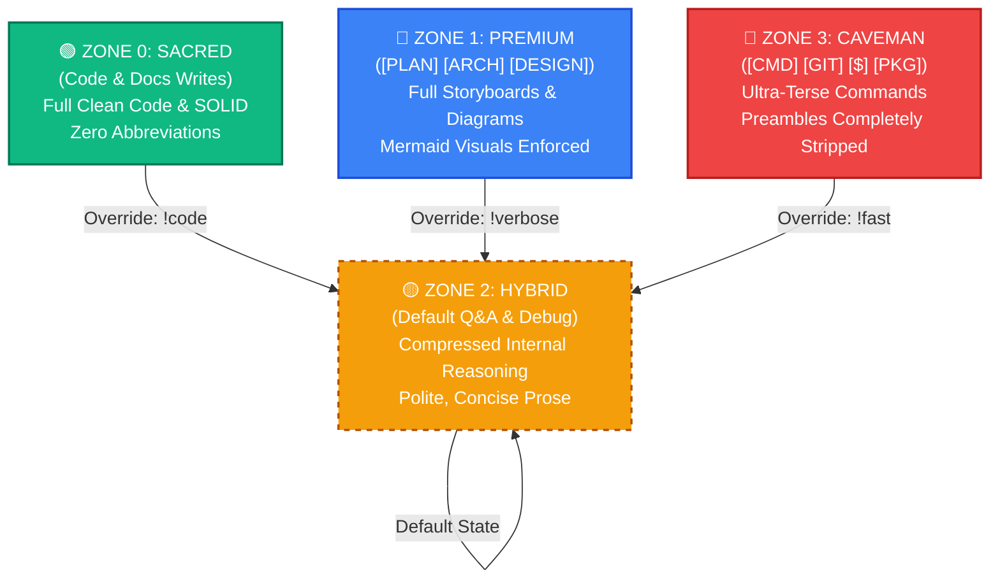

# ⚡ FinOps Token Optimization (Zone-Based Execution Model)

[](LICENSE)
[](CONTRIBUTING.md)
[](INSTALL.md)

An intelligent, workspace-level orchestration protocol designed to reduce LLM API cost and token usage by **60% to 90%** on routine tasks, without sacrificing correctness in production code.

---

## 🚀 Quick Install

Run the appropriate command in your project's root directory:

### macOS / Linux / WSL (Bash)
```bash
curl -fsSL https://raw.githubusercontent.com/Rezhnn/Token-Optimization/main/install.sh | bash
```

### Windows (PowerShell)
```powershell
irm https://raw.githubusercontent.com/Rezhnn/Token-Optimization/main/install.ps1 | iex
```

*For step-by-step manual setup, see [INSTALL.md](INSTALL.md).*

---

## 🗺️ The Four-Zone Model

The core engine is a dynamic routing system that shifts the agent's verbosity, reasoning depth, and output length based on the current task.



### Zone Details

| Zone | Label | Main Purpose | Style / Grammar | Token Budget |
|:---:|:---:|---|---|:---:|
| **0** | **Sacred** | Modifications to source files (`src/**`, `*.ts`, `*.py`) and code-docs (`README.md`, comments, docstrings). | Full standard programming prose. SOLID, KISS, DRY. Zero abbreviation. | **Unconstrained** |
| **1** | **Premium** | Full-depth system architecture, design specifications, user flows, and planning. | Extended markdown, Mermaid flowcharts, step-by-step storyboards. | **High** |
| **2** | **Hybrid** | General developer Q&A, explainers, comparative analyses, and troubleshooting. | **Default Mode.** Compressed/terse internal reasoning, clean final output. | **Medium** |
| **3** | **Caveman** | Terminal executions, git operations, packages installations, and fast confirmations. | Raw, functional "caveman grammar." No preambles, greetings, or conclusions. | **Minimal** |

---

## 📊 Token Usage Benchmarks

By limiting unnecessary responses and preambles during routine commands, context windows stay lightweight, keeping execution fast and API costs minimal.

### Token Consumption: Before vs. After

```text
Before Model (Always Verbose)
[████████████████████████████████████████] 100% (Avg. 2,610 tokens)

After Model (Zone-Based Routing)
[████████████████████] 50% (Avg. 1,305 tokens)

Operational Tasks (Git, CLI, Package Installs)
[████] 10% (Avg. 200 tokens — 90% Savings)
```

### Benchmark Results (Gemini 1.5 Pro / Claude 3.5 Sonnet)

| Test Query | Target Zone | Baseline (Tokens) | Optimized (Tokens) | Net Savings |
|:---|:---:|:---:|:---:|:---:|
| `[GIT] Commit changes and check status` | Zone 3 | 1,200 | 180 | **-85.0%** |
| `[PKG] Install express and setup script` | Zone 3 | 1,450 | 220 | **-84.8%** |
| `What does useEffect cleanup do?` | Zone 2 | 2,100 | 1,150 | **-45.2%** |
| `[ARCH] Design a cache architecture` | Zone 1 | 4,500 | 4,200 | **-6.6%** |
| `Write a fast binary search in search.ts` | Zone 0 | 3,800 | 3,800 | **0.0% (Sacred)** |

---

## ⚙️ Supported Agentic Tools
This model is compatible with any agentic workspace that supports system instructions or custom rules:
- **Google Antigravity SDK** (`GEMINI.md` / `.geminiignore`)
- **Claude Code** (`CLAUDE.md` / `.claudeignore`)
- **Cursor IDE** (`.cursorrules` / `.cursorignore`)
- **Windsurf** (`.windsurf` configuration)
- **Aider / Cline / Roo Code** (Universal system instructions)

---

## 🧑‍💻 Key Contributors & Sources

This project is built upon the following works:
1. **JuliusBrussee (Base Caveman Concept):** Creator of the original [caveman](https://github.com/JuliusBrussee/caveman) skill template and terse syntax rules.
2. **Anthropic & OpenAI (Verbosity Research):** Core insights regarding LLM prompt engineering, verbosity costs, and system prompt formatting limits.

---

## 📈 Star History

Track the community growth and engagement of this repository:

[](https://star-history.com/#Rezhnn/Token-Optimization&Date)

---

## 📄 License
This project is licensed under the MIT License — see the [LICENSE](LICENSE) file for details.
