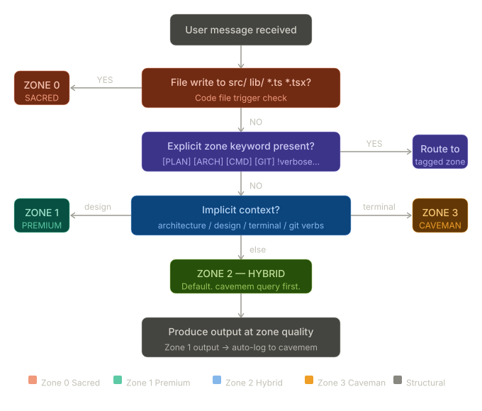

# ⚡ FinOps Token Optimization (Zone-Based Execution Model)

[](LICENSE)
[](CONTRIBUTING.md)
[](INSTALL.md)

An agent routing protocol for keeping workspace instructions predictable. It routes tasks into explicit zones, trims unnecessary preambles, and keeps terminal and package work terse. The install scripts write the workspace guides and ignore boundaries into the target project, so Antigravity, Claude Code, Cursor, and Codex can use the skill immediately in that workspace after installation. The current benchmark snapshot in `benchmarks/results/results.json` reports 26.8% average savings and 84.5% operational savings on the sample fixture set. Actual results vary by model, prompt shape, and workspace size.

---

## 🚀 Quick Install

Run the appropriate command in the root of the project you want to equip:

### macOS / Linux / WSL (Bash)
```bash
curl -fsSL https://raw.githubusercontent.com/Rezhnn/Token-Optimization/main/install.sh | bash
```

### Windows (PowerShell)
```powershell
irm https://raw.githubusercontent.com/Rezhnn/Token-Optimization/main/install.ps1 | iex
```

*For step-by-step manual setup, see [INSTALL.md](INSTALL.md).*

---

## 🗺️ The Four-Zone Model

The core engine shifts verbosity, reasoning depth, and output length based on the current task.



### Zone Details

| Zone | Label | Main Purpose | Style / Grammar | Token Budget |
|:---:|:---:|---|---|:---:|
| **0** | **Sacred** | Modifications to source files (`src/**`, `*.ts`, `*.py`) and code-docs (`README.md`, comments, docstrings). | Full standard programming prose. SOLID, KISS, DRY. Zero abbreviation. | **Unconstrained** |
| **1** | **Premium** | Full-depth system architecture, design specifications, user flows, and planning. | Extended markdown, Mermaid flowcharts, step-by-step storyboards. | **High** |
| **2** | **Hybrid** | General developer Q&A, explainers, comparative analyses, and troubleshooting. | Default mode. Compressed reasoning, clean final output. | **Medium** |
| **3** | **Caveman** | Terminal executions, git operations, package installs, and quick confirmations. | Raw, functional caveman grammar. No preambles or conclusions. | **Minimal** |

### Zone Priority

`Zone 0 > Zone 1 > Zone 2 > Zone 3`

Explicit tags such as `[PLAN]`, `[ARCH]`, `[CMD]`, `[GIT]`, `[PKG]`, and overrides such as `!verbose`, `!code`, and `!fast` control routing before the default zone logic runs.

---

## 📊 Token Usage Benchmarks

The current benchmark snapshot in `benchmarks/results/results.json` reports 26.8% average savings and 84.5% operational savings. When refreshing the benchmark harness, use current official model such as GPT-5.4 family models.

### Token Consumption: Before vs. After

```text
Before Model (Always Verbose)
[████████████████████████████████████████] 100% (Avg. 2,610 tokens)

After Model (Zone-Based Routing)
[███████████████████████████] 73% (Avg. 1,910 tokens)

Operational Tasks (Git, CLI, Package Installs)
[██████] 15% (Approx. 84.5% Savings)
```

### Benchmark Results

| Test Query | Target Zone | Baseline (Tokens) | Optimized (Tokens) | Net Savings |
|:---|:---:|---:|---:|---:|
| `[GIT] Commit changes and check status` | Zone 3 | 1,200 | 180 | **-85.0%** |
| `[PKG] Install express and setup script` | Zone 3 | 1,450 | 220 | **-84.8%** |
| `What does useEffect cleanup do?` | Zone 2 | 2,100 | 1,150 | **-45.2%** |
| `[ARCH] Design a cache architecture` | Zone 1 | 4,500 | 4,200 | **-6.6%** |
| `Write a fast binary search in search.ts` | Zone 0 | 3,800 | 3,800 | **0.0% (Sacred)** |

*These rows are sample task fixtures.*

---

## ⚙️ Supported Agentic Tools

This repo is designed to work across tools that honor workspace rules and aligned ignore boundaries.

Installed directly by the scripts:

- Antigravity
- Claude Code
- Cursor
- Codex
=======

Compatible with the shared boundary files and manual workspace adoption:

- Windsurf
- Aider
- Cline
- Roo Code

The shared boundary files are `.geminiignore`, `.cursorignore`, `.claudeignore`, `.codexignore`, and `.openaiignore`.

---

## 🧑‍💻 Key Contributors & Sources

This project is built upon the following works:
1. [JuliusBrussee](https://github.com/JuliusBrussee) (base caveman concept): original [caveman](https://github.com/JuliusBrussee/caveman) skill template and terse syntax rules.
2. Anthropic, OpenAI, and Google AI for Developers: routing, verbosity, and current model-family references used by the benchmark notes.

---

## 📈 Star History

Track the community growth and engagement of this repository:

[](https://star-history.com/#Rezhnn/Token-Optimization&Date)

---

## 📄 License
This project is licensed under the MIT License - see the [LICENSE](LICENSE) file for details.
